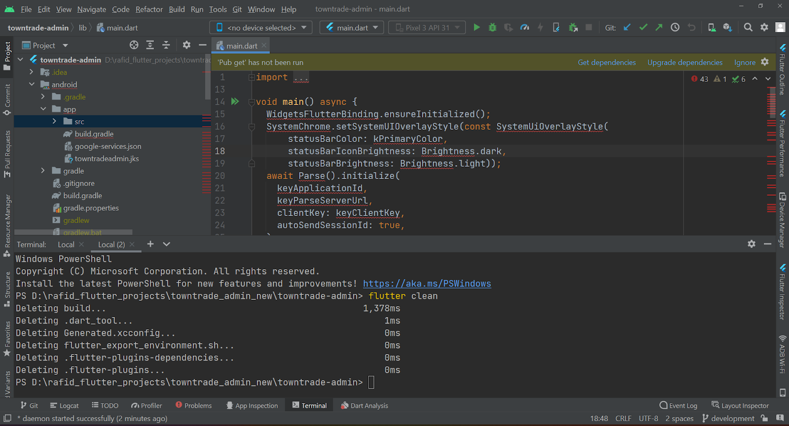
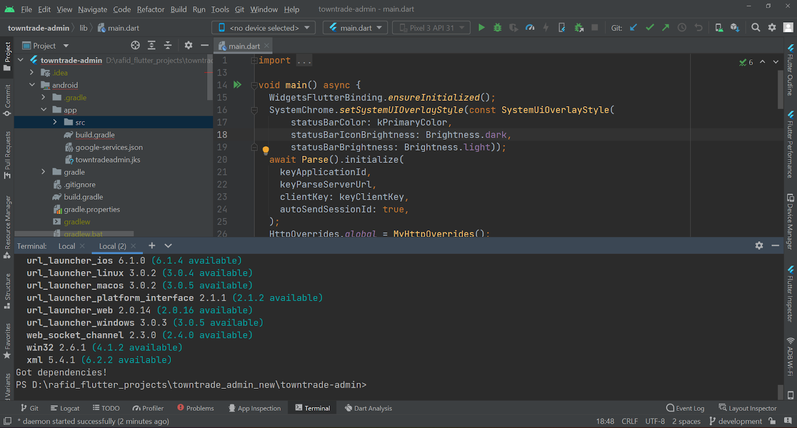
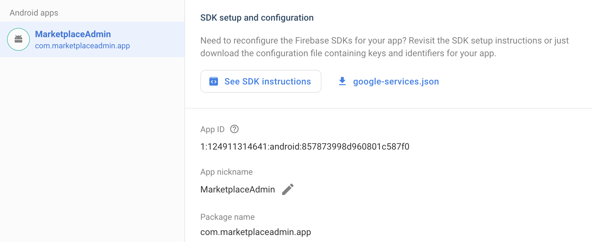
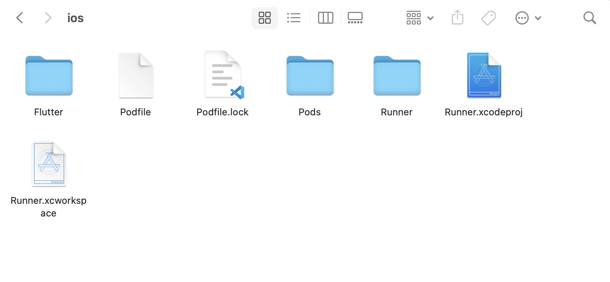
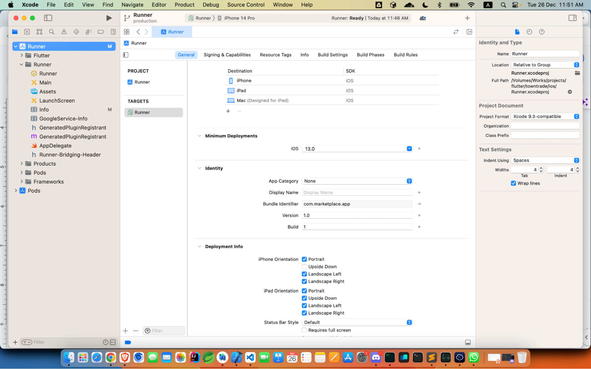

# Build the Admin App

## Build the Admin App for Android

1. Open the terminal in the Android studio. Run the command `flutter clean`.



2. Run the command `flutter pub get`.



3. Make sure you have added `google-services.json` file to the project as described in the previous step. You can find the `google-services.json` file on Firebase console.



Now the code is ready to run. Let’s hit the run button in the Android studio and our Admin app should run on the connected Android device or emulator.

## Build the Admin App for iOS

To build the customer app for iOS, we need to follow the next steps. It is to mention that, to build the app for iOS, you must need a Mac PC running at least Mac OS Ventura running XCode 13 or higher.

1. Repeat the step 1 and 2 from building the app for Android described in the previous section, i,e run this 2 commands in the terminal within the project directory.

```
   flutter clean
   flutter pub get
```

2. Open the project folder in finder and you’ll see an iOS folder there. Open that folder and it should look like the following image.



3. Double-click on `Runner.xcworkspace` file and it opens up the project in XCode.
4. Now, let’s go to our browser to the Firebase Console and open our firebase app. Now we need to go to the project settings like the Android app process in the previous section.

Now click on “Add App” button and fill up the information as requested.


5. In the above image, we need to put the apple bundle ID. We’ll find that in XCode in the General tab, the field we are looking for is `Bundle Identifier` like the image. Copy that and paste into the form at step 4\. In the app nickname, add the app name you have set. And download the config file called GoogleService-info.plist and add that file to the iOS project.
6. To do that, right click on Runner in XCode and select `Add files to Runner` and select the `GoogleService-info.plist` downloaded previously. Make sure, this file and `info.plist` file remains in the same directory like the image below.



7. Now, in the terminal, run the following command.

```
cd iOS
pod install
```

Make sure you have cocoapods installed in your Mac. If you don’t have cocoapods, you can use the following link to install that. [Cocoapods Installation](https://guides.cocoapods.org/using/getting-started.html)

8.  let’s run the app in XCode. App should build and run in the simulator.
