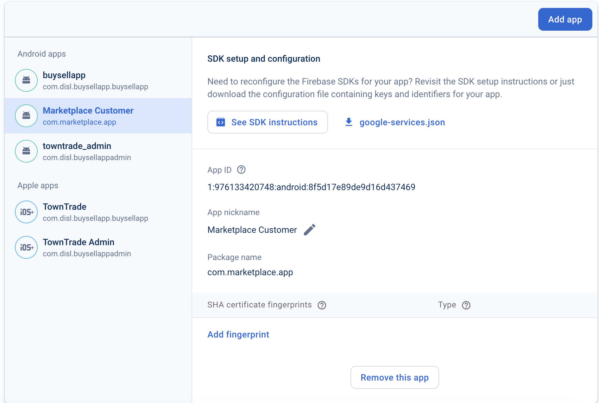

# Build the Customer App for Android

1. Open the terminal in the Android studio. Run the command \- `flutter clean`.

2. Run the command \- `flutter pub get`.

3. Make sure you have added `google-services.json` file to the project as described in the previous step. You can find the `google-services.json` file on Firebase console.

Now the code is ready to run. Let’s hit the run button in the Android studio and our Admin app should run on the connected Android device or emulator.
