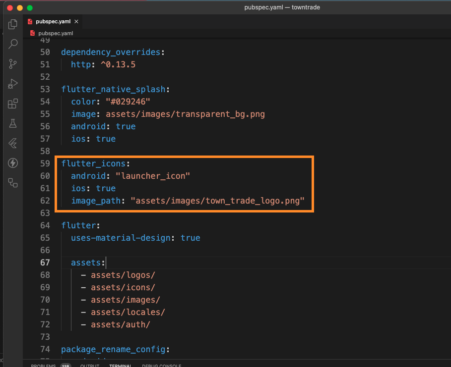

# Update App Icon and Splash Screen of the Apps

## Changing App Icon

This guide will help you change the app icon of Towntrade Customer App and Towntrade Admin App using the `flutter_launcher_icons` package (version 0.13.1).

### Step 1: Adding Images to public

First, add or replace the new image you want to use as your app icon. For example, you might place it inside the `/images/` folder:

- For iOS: Recommended icon size is 1024x1024 pixels.
- For Android: Recommended icon size is 512x512 pixels.


## Step 2: Update the Path in `pubspec.yaml`

Next, update the `pubspec.yaml` file to point to the new image path.

- If you want to use same images for iOS and Android:
  Open `pubspec.yaml` and locate the `flutter_icons` section. Change the `image_path` to the path of the new image:



- If you want to use different images for iOS and Android, you can specify separate paths for each:

```yaml
flutter_icons:
  android: true
  ios: true
  android_icon: "/images/android_app_icon.png"
  ios_icon: "/images/ios_app_icon.png"
```

## Step 3: Regenerate the App Icons

After updating the pubspec.yaml file, regenerate the app icons by running the following command:

```bash
flutter pub run flutter_launcher_icons:main
```

## Changing Splash Screen

This guide walks you through the steps to set up and customize a splash screen in your app using the `flutter_native_splash` package.

### Step 1: Adding Images to public

First, add or replace the new image you want to use as your Splash Screen. For example, you might place it inside the `/images/` folder.Ensure that the image is correctly named and saved in the appropriate folder. It is recommended that the image is in PNG format for better compatibility.


## Step 2: Update the Splash Screen Configuration

Next, update the flutter_native_splash configuration in your pubspec.yaml file to point to the new splash image.

In the pubspec.yaml, locate the flutter_native_splash section and change the image field to point to the new splash image path:


## Step 3: Regenerate the Splash Screen

After updating the image path in your configuration, regenerate the splash screen by running the following command:

```bash
flutter pub run flutter_native_splash:create

```
