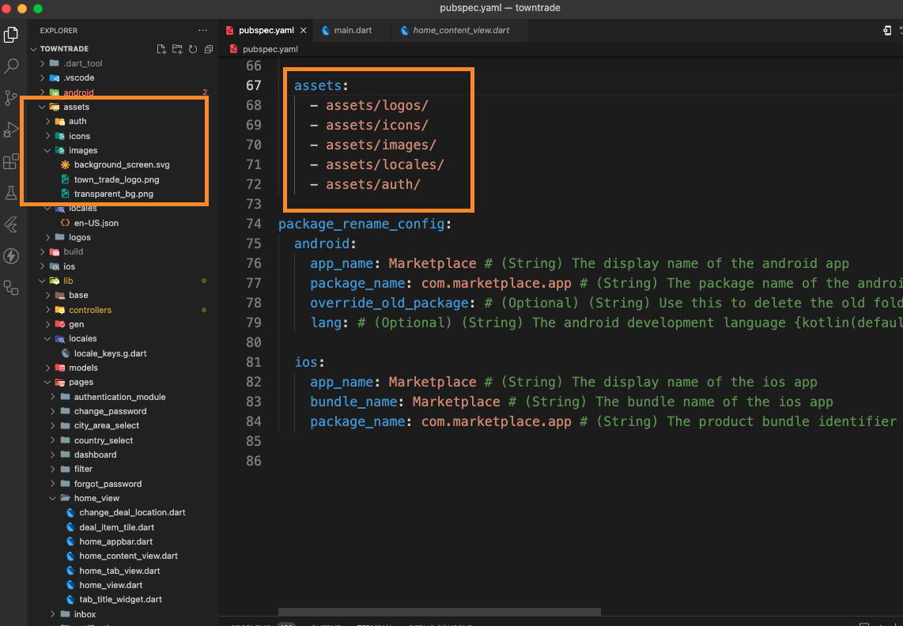
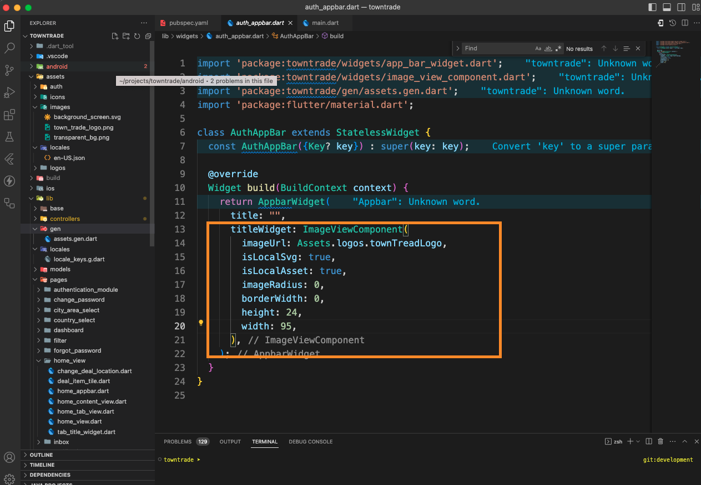

# Changing Graphical public in the Project

This guide explains how to update and manage graphical public, such as images, icons.

## Update In-App Images

- Place your new images in the /images/ or /icon/ directory , Or you can create new directory. Make sure the directory structure is organized as needed.
- Ensure that the new images are registered in the pubspec.yaml file.



- After registered the image regenerate the public by running the following command:

```bash
dart run build_runner build
```

## View Images

you can view image by use ImageViewComponent.

- Update your image path.
- If use svg image from public, set isLocalSvg: true and isLocalAsset: true,
- If use png/jpg/jpeg image from public, set isLocalAsset: true.
- If use network image,isLocalAsset: false,


