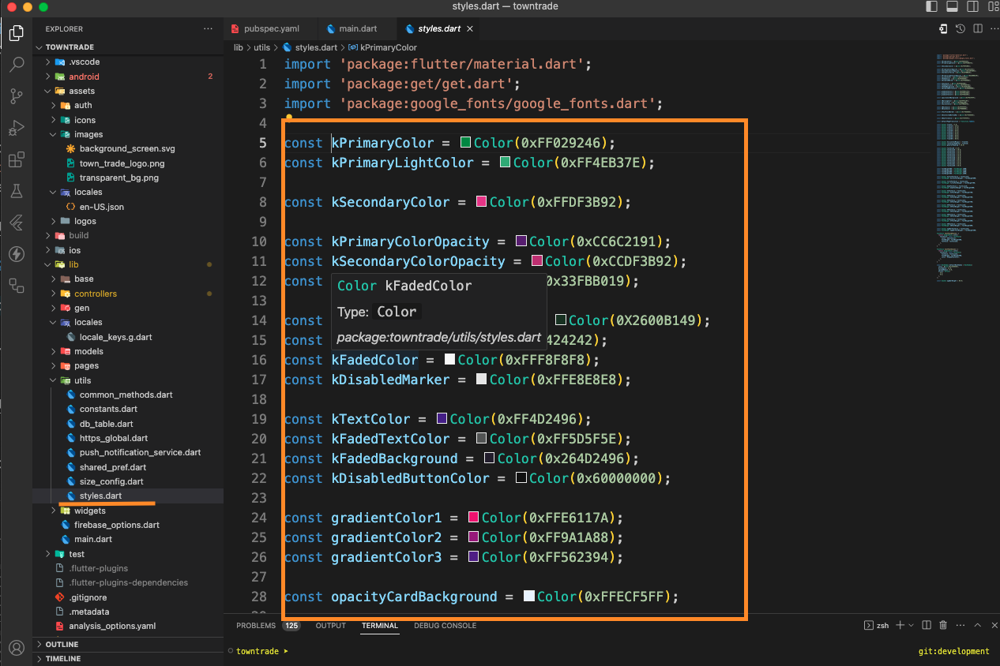

# Changing Themes and Colors of The Apps

This guide walks you through the steps of customizing the themes and colors of your app. Here you can globally set colors, fonts, and other design properties for a consistent look across your app.

## Step 1: Define a Theme in `themeData`

Flutter’s `ThemeData` class allows you to define global styles for your app. You can customize various properties like the primary color, accent color, typography, and more.

### Example Basic Theme

In the `MaterialApp` widget, you can set a `theme` parameter with a `ThemeData` instance:

This sets the basic app colors like the primary color, accent color, and font family, which will be applied globally throughout your app.

## Update Colors in `style.dart`

If you want to update the theme's colors, you can do so in a centralized file like `style.dart`, which is used to manage the app's color scheme. This approach allows for easier maintenance and consistency across your app.

### Example of Updating Colors

- Define Colors in `style.dart`

First, define your colors in `style.dart`. For instance, you can change the primary color and accent color by updating their HEX color values:

