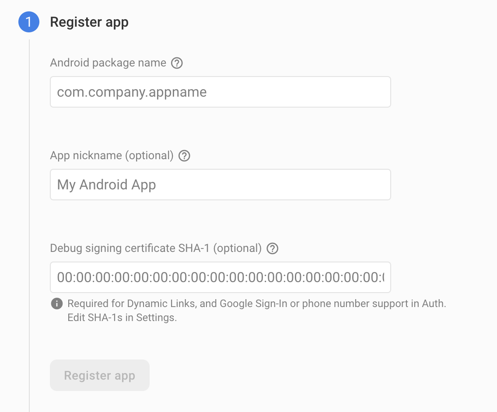
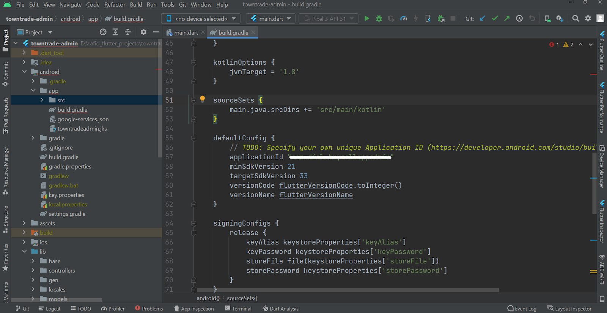

# Connect the Customer App with the Firebase Project

Previously we have created a firebase project in the Firebase console. Now, we need to connect our Customer app with this project. In order to do that, we need to do the following steps.

## Connect Android App to Firebase Project

1. Click on the Gear Icon to the right of ‘Project Overview’ in the left menu. It will open a menu, click on the project settings. The project settings page will open up.
2. In the General tab, navigate to the bottom. Click on the Android icon. It opens up a form like the image.

3. In the Android package name, enter the package name that you have chosen while renaming the package. You can also find it in android &rarr; app &rarr; build.gradle file. Copy the applicationId and paste it to the firebase form on step 2.
4. Also, set the App Nickname, use the same name that you have chosen in the project renaming part.
5. At this point, it will provide us a google-services.json file. Let’s download that file and put it in the android &rarr; app directory within the project. See the following image as reference.
6. Since our codebase already has a empty `google-services.json` file in place, so you can just copy the contents of your 'google-services.json' file and paste it in the existing file.

## Connect iOS App to Firebase Project

You can skip this part for now if you want. You can come back here later when you configure and build the iOS version of the app as described [here](build-ios-app.md).

Now, let’s go to our browser to the Firebase Console and open our firebase app. Now we need to go to the project settings like the Android app process in the previous section.

Now click on “Add App” button and fill up the information as requested.

1. In the above image, we need to put the apple bundle ID. We’ll find that in XCode in the General tab, the field we are looking for is “Bundle Identifier” like the image. Copy that and paste into the form at step 4. In the app nickname, add the app name you have set. And download the config file called GoogleService-info.plist and add that file to the iOS project.
2. To do that, right click on Runner in XCode and select ‘Add files to Runner’ and select the GoogleService-info.plist downloaded previously. Make sure, this file and info.plist file remains in the same directory like the image below.

