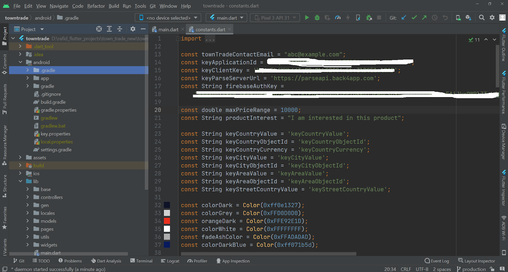

# Connect The App to Back4App

In the [Setup & Configure Back4App Application](setting-backendserver-database.md), we have created an application and we got out ApplicationId and ClientKey. Now we need to copy both the applicationId and clientKey. And we Open the file lib/utils/constants.dart. Search for keyApplicationId, keyClientKey.

Now, we need to replace the value of the variable keyApplicationId with the applicationId from the back4App console and replace the keyClientKey variable with the value of the clientKey.

