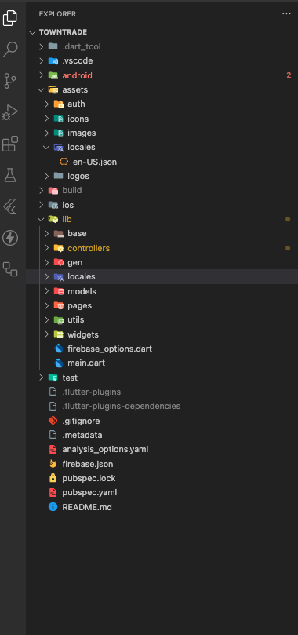

# Directory Structure

## Base

Contains base classes, app configurations like Loading, Handle error, Image Dialog, Empty Data Widget,Reset GetX Values etc.

## Controllers

Stores controller files, potentially related to managing the state and logic of your views. This could indicate a separation of business logic from the UI.

## Gen

Contains generated image files.

## Locales

Contains generated language files.

## Models

Data model are defined for easier data handling and manipulation.

## Pages

Contains all screens of the application.

## Utils

Contains all app utility functions like helper functions , theme utilities etc.

## Widgets

Contains all UI widget used in the application like: Buttons, TextFields,AppBars,BottomSheet etc.

## FirebaseOptions

Contains FirebaseOptions like: projectId, messagingSenderId, storageBucket etc.
