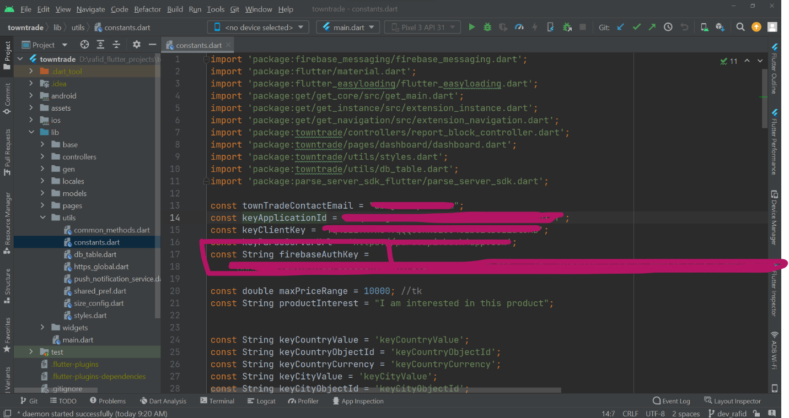

# Enable Firebase Cloud Messaging or Push Notification

Open the firebase console and go to Project Settings. Select Cloud Messaging and Check the Cloud Messaging API Legacy. If that’s disabled, enable it from Google Cloud Console. When enabled, Click Add Server Key. Now we should be able to see the Server Key.

Open the file lib/utils/constants.dart. Search for firebaseAuthKey.Copy the Server Key from the previous step and set it to the value of firebaseAuthKey.

