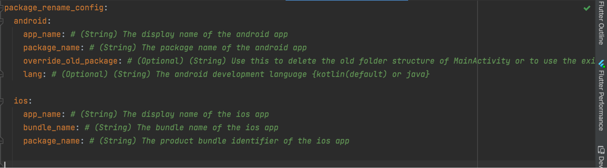
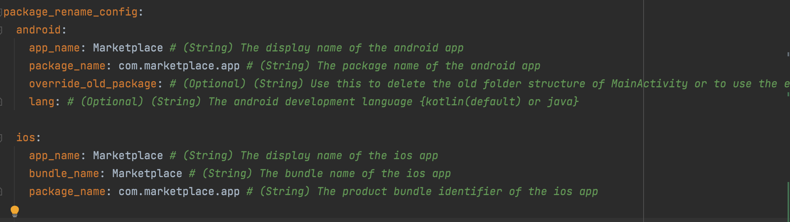

# Rename the App & Package Name

The first thing we need to do is to rename the App and its package name to match our business name.

In the root directory of the project, there is a file called ‘pubspec.yaml’. Open the file in the Editor. You’ll find a block like this at the bottom of the file:



If you want to build it for Android, you need to set `app_name` & `package_name` in the android block. To build for iOS, you need the set all 3 fields `app_name`, `bundle_name` & `package_name` that we see in the ios block. After updating the information, it should look like this.



Now, open the terminal in the root directory of the project within Android Studio and run the following command,

```
flutter pub run package_rename
```

If the command executes without any problem, the project should be renamed and ready to build. However, if we build the project now, it will show an error ‘No matching client found for package name 'com.marketplace.app'’. We’ll solve this problem in the next section.
