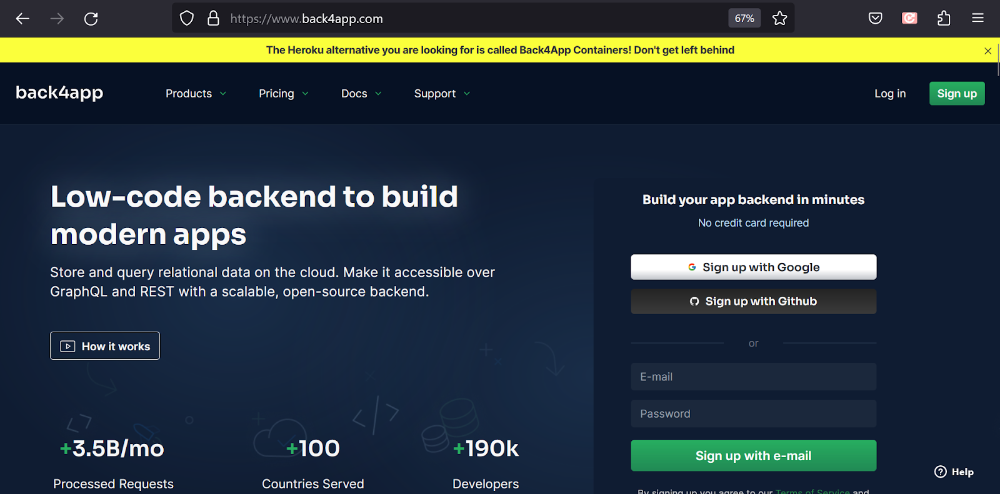
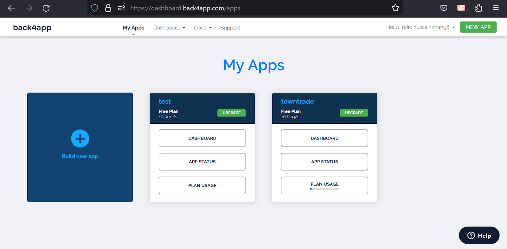
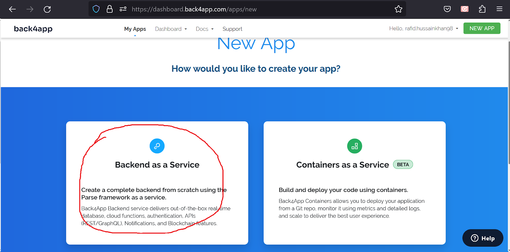
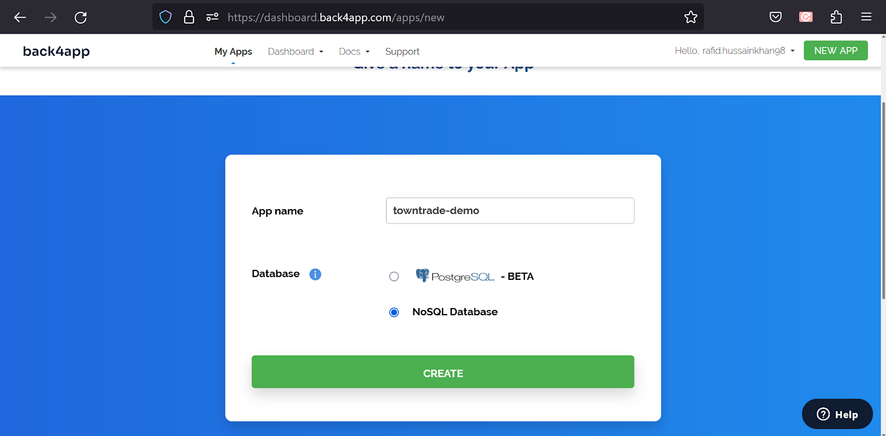
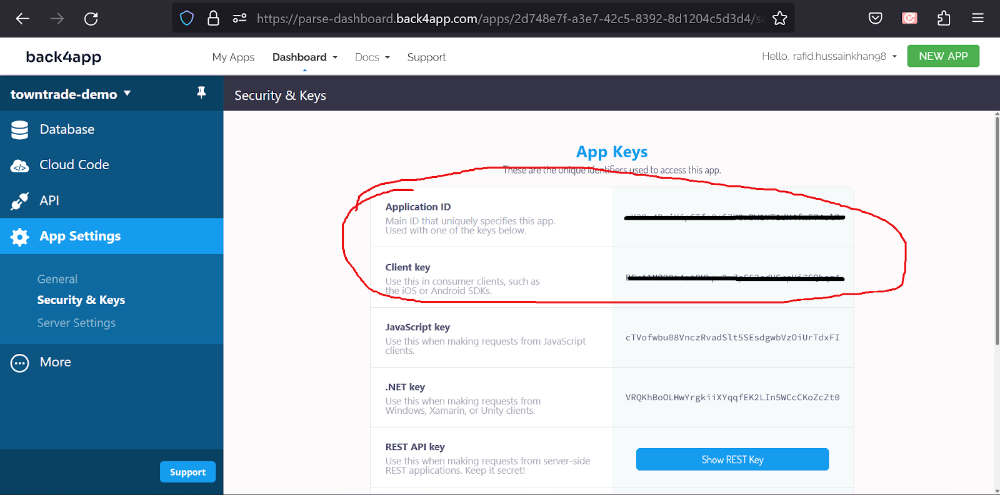

# Setting Up the Backend Server & Database

For the backend APIs and Database, we use [Parse Platform](https://parseplatform.org/) in this project. It was initially a Facebook product and later it was made open source. So, if you are a developer and familiar with Node.js for server-side development, you can use the Open Source Parse-Server & related applications & host it in your preferred VPS server.

However, we’ll use a deployment-ready Parse server provided by [Back4app.com](https://www.back4app.com/). They provide everything we need to get started in no time. And we’ll get a bunch of great tools as well to implement some features easily, we’ll get a ready admin dashboard to manage our data and many other useful stuff.

## Setup & Configure Back4App Application

Go to the website: [https://www.back4app.com/](https://www.back4app.com/)

Login to the console. If you don’t have an account, sign up first. After login, you are on this page:

1. Click on the ‘Build New App’ Button
2. Select Backend as a service

3. Set the name of your app, select NoSQL Database, and click on the Create button.

Now your parse console is prepared. To use this on your flutter code, you need an Application ID and Client key. To get these keys, select App Settings -> Security & Keys:  
Save it for now. We are going to need them in the coming steps.

****

## Setup & Configure Firebase Console

We use Google Firebase for a couple of very useful features in this App. For example, verifying user phone numbers, sending push notifications, app analytics and several others. So, we need to connect Google Firebase with our project with the following steps. Let’s open

- Open the Firebase console following this link: [https://console.firebase.google.com/](https://console.firebase.google.com/)
- Click create a new project. Follow the instructions in the steps and finish the process. Enable Google Analytics in the process. It will take a minute to complete and when finished, Click continue and it will take you inside the Firebase project.

We have more work to do here. We are going to come back to Firebase after changing a few important things in the codebase.
